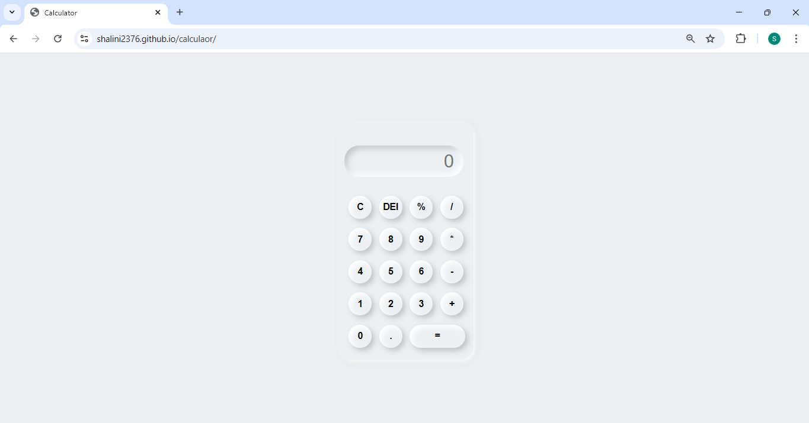

# Calculator

A simple **calculator web application** built using **HTML, CSS, and JavaScript** as part of frontend practice.  
This project focuses on basic arithmetic operations and JavaScript event handling.

## ✨ Features
- Perform basic arithmetic operations: addition, subtraction, multiplication, and division
- Clear and reset functionality
- Interactive button-based UI
- Real-time result display
- Clean and minimal design

  ## 📸 Screenshot
  

## 🛠 Tech Stack
- HTML5
- CSS3
- JavaScript (Vanilla)

## ▶️ How to Run Locally
1. Clone the repository:
   ```bash
   git clone https://github.com/shalini2376/calculaor.git
   ```
2. Open the project folder.
3. Open index.html in your browser.
